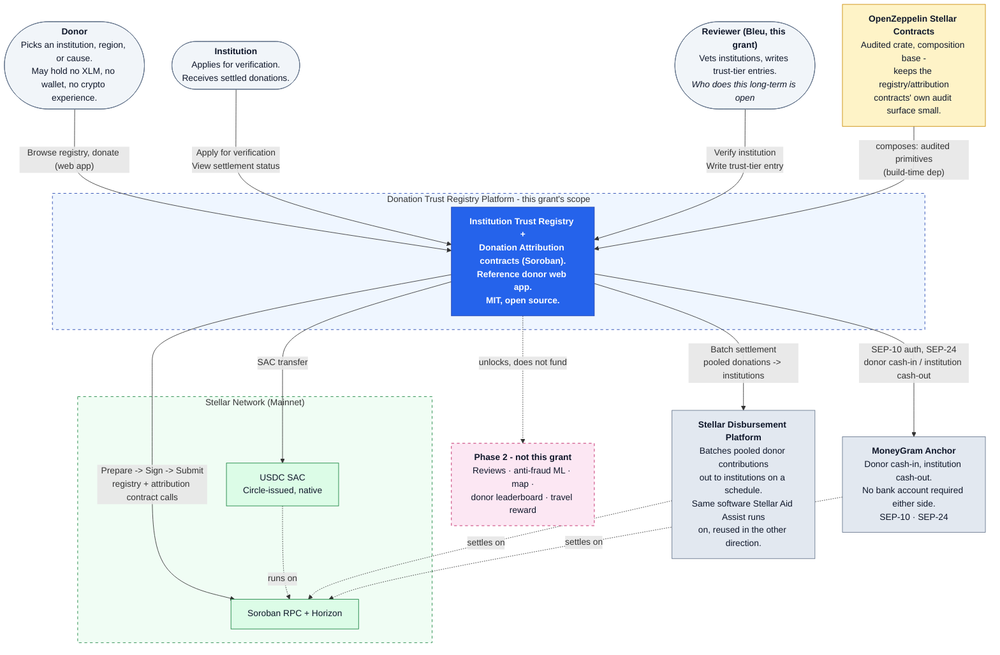
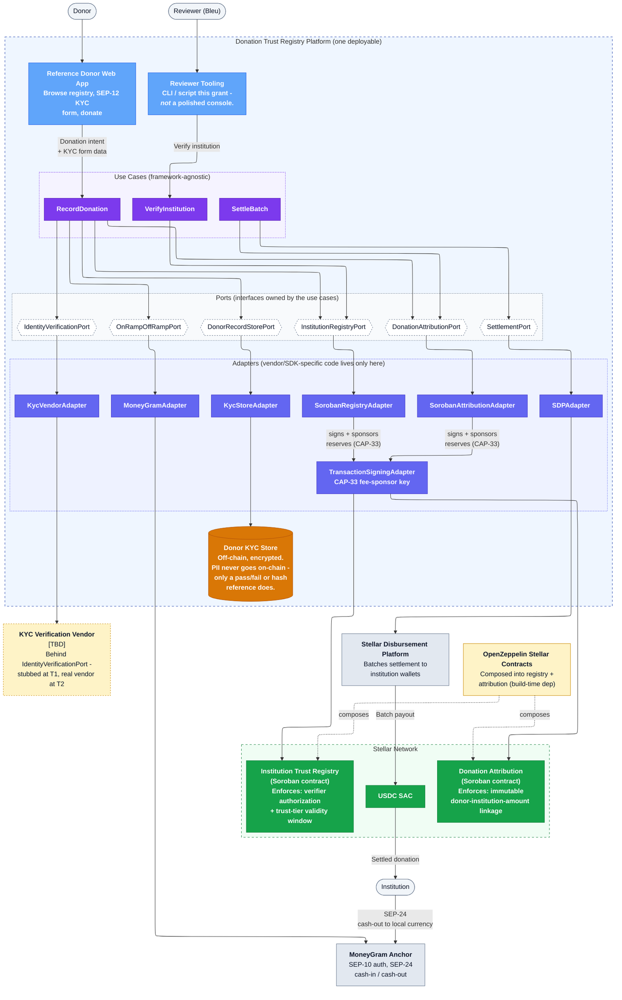

# Architecture: Donation Trust Registry

This is the target architecture for the full system this grant funds — the registry, the
MoneyGram/SDP payment rails, and the donor app. For what's actually built and live on testnet
today, see [DESIGN.md](DESIGN.md); the short version: the Institution Trust Registry contract
and the reference donor app (Browse/Register/Donate) are real and deployed, the SEP-10/SEP-24
donate flow runs against Stellar's public test anchor (not MoneyGram's production anchor yet,
which requires partner approval), and the Donation Attribution contract, Stellar Disbursement
Platform integration, and KYC vendor below are planned, not yet built.

## L1 — System Context

Who talks to what, at the level a reviewer skimming the proposal needs.

Three actors (donor, institution, the reviewer doing verification), one platform boundary (what
this grant funds), two rails (MoneyGram, Stellar Disbursement Platform) reused from Aid Assist
in the opposite direction, and Phase 2 named but explicitly outside the funded boundary.

## L2 — Containers (Clean Architecture pass)

One level down: the actual pieces inside the platform boundary, and how a donation moves end to
end, once the full grant scope (not just today's PoC) is built.

**Layering, and why.** Not a microservices proposal — one deployable service, disproportionate
to split further for a $90K/5-month grant — but internally layered so vendor-specific code stays
out of the business rules:

- **Use Cases** (`VerifyInstitution`, `RecordDonation`, `SettleBatch`) contain the actual business
  rules and import no vendor SDKs.
- **Ports** are the interfaces the use cases depend on — `InstitutionRegistryPort`,
  `IdentityVerificationPort`, `OnRampOffRampPort`, `DonationAttributionPort`,
  `DonorRecordStorePort`, `SettlementPort`.
- **Adapters** implement those ports and are the only place vendor/SDK-specific code lives —
  `SorobanRegistryAdapter`, `SorobanAttributionAdapter`, `KycVendorAdapter`, `MoneyGramAdapter`,
  `SDPAdapter`, `KycStoreAdapter`, plus a shared `TransactionSigningAdapter` (the CAP-33
  fee-sponsor key lives in exactly one place, not duplicated across the two contract adapters).

**Reviewer authorization has one explicit owner.** `ReviewerTool` routes through
`VerifyInstitution` → `InstitutionRegistryPort`, the same path shape as the donor side — not a
direct write to the registry contract that bypasses every other layer. Who's authorized to
write a trust tier may grow past just Bleu over time (see the on-chain reviewer role in
[DESIGN.md](DESIGN.md)), so that authorization rule needs one testable owner, not something
living implicitly in "only Bleu runs the CLI."

**Why the KYC vendor being TBD doesn't block the architecture.** The *port* has to exist now
regardless of which vendor eventually fills it: the dual-compliance rule — donor identity
verification independent of MoneyGram's own KYC — has to hold no matter which vendor implements
the check, which is exactly what a port buys. The milestones are also asymmetric — MoneyGram
sandbox is a Tranche #1 gate, SEP-12 KYC live is a separate Tranche #2 gate — meaning the code
has to run at T1 behind a stub and swap in a real vendor at T2 without rewriting `RecordDonation`.
The same reasoning applies to `SettlementPort`: whether SDP is self-hosted or SDF-run is also
unresolved, and also shouldn't require rewriting `SettleBatch` once it's decided.

**Where the two Soroban contracts sit, conceptually.** Once deployed under the Tranche #3 2-of-3
multisig, these contracts satisfy Clean Architecture's Entities-independence goal better than a
typical off-chain Entities layer — nobody can quietly change how trust-tier expiry or attribution
immutability behaves without a visible, signed upgrade. For the invariants each contract enforces
at the point of state mutation (labeled on the nodes above), they're playing the Entities role.
That doesn't make them Use Cases, though — a Soroban call is an atomic state transition and
structurally can't sequence "verify identity AND confirm funds landed AND attribute AND enqueue
settlement." That sequencing is why the Use Case layer exists off-chain, calling into the
contracts through Ports the way it would call a repository — except this "repository" also
self-enforces its own invariants at the boundary.

**CAP-33 sponsored reserves** (no-XLM donor onboarding) isn't its own box — it's a signing/fee
responsibility of whichever adapter submits to Stellar, shown as the "signs + sponsors reserves
(CAP-33)" label on the edge into `TransactionSigningAdapter` — a fee-sponsor key Bleu controls,
signing every donor-side transaction, and a real operational commitment an external audit will
ask about.

## Open architecture questions

- KYC vendor choice — architecturally resolved either way (behind `IdentityVerificationPort`);
  only the vendor name is open.
- Whether the Stellar Disbursement Platform is self-hosted by Bleu or consumed as an SDF-run
  service — not yet resolved. Same shape as the KYC vendor question; also architecturally
  absorbed by a port (`SettlementPort`) rather than blocking the design.
- The custody question: the pooled/batched settlement step between `SettleBatch` and
  `SDPAdapter` is the exact point where a brief custodial hop could exist. This diagram doesn't
  resolve that — an external-counsel legal memo does, before mainnet.
- Not yet decided: whether `TransactionSigningAdapter`'s fee-sponsor key is a single key or a
  rotation/multisig scheme of its own before mainnet.
